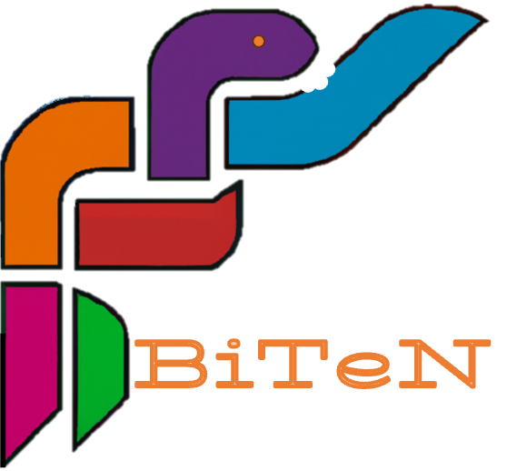

<h2><em>Bi</em>oinformatics <em>Te</em>mplate in <em>Ne</em>xtflow</h2>  

   

BiTeN is a short pipeline written in nextflow that aims to be used as a template for nextflow pipeline development.  

Nextflow is a free, open source software project that facilitates the execution of a computational workflow consisting of a series of interconnected steps/tasks. Utilizing Nextflow can take various forms. This repository offers a specific example illustrating how a bioinformatician can organize their code to be executed using Nextflow.

## Table of Contents

   * [Foreword](#foreword)
     * [Project layout](#project-layout)
     * [Helping to develop](#helping-to-develop)
   * [Installation](#installation)
      * [BiTeN](#biten)
      * [Nextflow](#nextflow)
      * [Container platform](#container-platform)
        * [Docker](#docker)
        * [Singularity](#singularity)  
   * [Usage and test](#usage)
   * [Parameters](#parameters)
   * [Uninstall](#uninstall)
   * [Contributing](#contributing)
   * [Report bugs and issues](#report-bugs-and-issues)
   * [How to cite?](#how-to-cite)
   * [Acknowledgement](#acknowledgement)

## Foreword

The pipeline and the whole repository (readme/Contributing/etc) can be use as template for nextflow pipeline projects.
Comment in pipeline's code help the user to better understand the different usages. 

This pipeline template follow the following steps:

- handling parameters, file input and help (Deal with gz and not gz file, deal with paired and unpaired input reads, etc.)
- QC
- Alignment
- file conversion (sam2bam)
- file sorting (samtools_sort)

### Project layout
    
    BiTeN/
    ├── README.md               # Documentation that gives users a detailed description of a project and with guidelines on how to use it.
    ├── LICENSE                 # Lience of your projet. Licenses are important for open-source projects because they set the legal terms and conditions for using, distributing, and modifying the software
    ├── CONTRIBUTING.md         # Provides potential project contributors with a short guide to how they can help with your project 
    ├──  img                    # Folder containing images used by the README
    |
    |         // FROM HERE IT IS RELATED TO THE NEXTFLOW PIPELINE
    |
    ├── main.nf                # The nextflow main executable file use to run your pipeline. It contains the logic of your pipeline
    ├── modules/               # Modules folder contains components that can be included in workflows. Think as functions in programming languages. Module were introduced in DSL2. See https://www.nextflow.io/docs/latest/module.html It is encouraged to have a module file by tool.
    │   ├── bowtie2.nf         # A module file containings processes (the basic processing primitive to execute a user script see https://www.nextflow.io/docs/latest/process.html#processes) related to the bowtie2 tool.
    │   ├── fastqc.nf          # A module file containings processes related to the fastqc tool.
    │   ├── samtools.nf        # A module file containings processes related to the samtools tool.
    │   └── template.nf        # A template module file.
    ├── subworkflows/          # Subworkflows folder contains workflow components that can be included in other workflows, typically used by the main workflow in the main.nf 
    ├── nextflow.config        # Configuration file. Nextflow has multiple way to handle config ((see here)[https://www.nextflow.io/docs/latest/config.html#configuration-file]). We can define it this file, parameters, profiles, etc.
    ├── ressources/            # Contains configuration files that define the differents ressources i.e. computing and tools
    │   ├── computing/         # Contains configuration files that define the computing ressources that will be loaded via profiles
    │   │   ├── hpc.config     # A hpc configuration that define computing ressource on HPC (CPU, TimeOut, RAM per process/label and other information like parallelisation and scheduler)
    │   │   └── local.config   # A local configuration that define computing ressource on local machine (CPU, TimeOut, RAM per process/label).
    │   └── softwares.config   # A software configuration that define where Nextflow have to fetch the container of each tool.
    └── test                   # Folder containing a test data set 
        ├── read_test.fastq.gz
        └── genome_test.fa


### Helping to develop

**Documentation**

 * [Nextflow Documentation](https://www.nextflow.io/docs/latest/index.html) The official nextflow documentation very well written. Do not hesitate to extensively use the search bar!
 * [Basic pipeline example from nextflow.io](https://www.nextflow.io/example1.html) Do not hesitate to look at other examples
 * [Nextflow Training Fundamentals](https://training.nextflow.io/basic_training/) The offical training module from nextflow.io to learn the fundamentals.
 * [Nextflow Training Advanded](https://training.nextflow.io/advanced/) The offical training module from nextflow.io for advanced users.
 * [Nextflow Cheat Sheet](https://github.com/danrlu/nextflow_cheatsheet/blob/main/nextflow_cheatsheet.pdf) A nice nextflow cheat sheet made by @dabrlu .
 * [Software Carpentry Nextflow training](https://carpentries-incubator.github.io/workflows-nextflow/index.html). High quality course made by the [Software Carpentry](https://software-carpentry.org).
 * [Bioinformatics Workshop on Tools for Reproducible Research - Nextflow](https://southgreenplatform.github.io/training_reproducible_research/pages/nextflow/nextflow-1-introduction/) A course based on [NBIS material](https://github.com/NBISweden/workshop-reproducible-research) to learn Nextflow basics.

**Community**

 * [Nextflow Slack](https://www.nextflow.io/slack-invite.html)
 * [Nf-core](https://nf-co.re/) A community effort to collect a curated set of analysis pipelines built using Nextflow.
 * [Seqera Community](https://community.seqera.io/)

## Installation

The prerequisites to run the pipeline are:  

  * The BiTeN repository
  * [Nextflow](https://www.nextflow.io/)  >= 22.04.0
  * [Docker](https://www.docker.com) or [Singularity](https://sylabs.io/singularity/) 

### BiTeN 

```bash
# clone the workflow repository
git clone https://github.com/Juke34/BiTeN.git

# Move in it
cd BiTeN
```

### Nextflow 

  * Via conda 

    <details>
      <summary>See here</summary>
      ```
      conda create -n nextflow
      conda activate nextflow
      conda install nextflow
      ```  
    </details>

  * Manually
    <details>
      <summary>See here</summary>
       Nextflow runs on most POSIX systems (Linux, macOS, etc) and can typically be installed by running these commands:

      ```
      # Make sure 11 or later is installed on your computer by using the command:
      java -version

      # Install Nextflow by entering this command in your terminal(it creates a file nextflow in the current dir):
      curl -s https://get.nextflow.io | bash 

      # Add Nextflow binary to your user's PATH:
      mv nextflow ~/bin/
      # OR system-wide installation:
      # sudo mv nextflow /usr/local/bin
      ```
    </details>

### Container platform

To run the workflow you will need a container platform: docker or singularity.

### Docker

Please follow the instructions at the [Docker website](https://docs.docker.com/desktop/)

### Singularity

Please follow the instructions at the [Singularity website](https://docs.sylabs.io/guides/latest/admin-guide/installation.html)

## Usage

You can first check the available options and parameters by running:
`nextflow run BiTeN.nf --help`

To run the workflow you must select a profile according to the container platform you want to use:   
- `singularity`, a profile using Singularity to run the containers
- `docker`, a profile using Docker to run the containers

The command will look like that: 
```
nextflow run main.nf -profile docker <rest of paramaters>
```
Another profile is available (/!\\Work in progress):

- `slurm`, to add if your system has a slurm executor (local by default) 

The use of the `slurm` profile  will give a command like this one: 
```
nextflow run main.nf -profile docker,slurm <rest of paramaters>
```

## Test the workflow

Test data are included in the BiTeN repository in the `test` folder.

A typical command to run a test on single end data will look like that:

```
nextflow run -profile docker BiTeN.nf --genome test/hpv16.fa --reads test/U2OS_A1_R1_sub100000.fastq --single_end true --reads_extension .fastq
```

On success you should get a message looking like this:
```
  BiTeN Pipeline execution summary
    --------------------------------------
    Completed at : 2024-03-07T21:40:23.180547+01:00
    UUID         : e2a131e3-3652-4c90-b3ad-78f758c06070
    Duration     : 8.4s
    Success      : true
    Exit Status  : 0
    Error report : -
```

## Parameters

      | Parameter | Comment |
      | --- | --- |
      | --help           | prints the help section |
      | --reads          | path to the directory containing the reads |
      | --pattern_reads  | pattern to match the read files. In the case of single end data it would looks like: "*.fastq.gz". In the case of paired end data it would looks like: "*_{R1,R2}_001.fastq.gz" or "*_{1,2}.fastq.gz" |
      | --single_end     | Boolean to inform if we have a single end or paired end data. |
      | --stranded       | Boolean to inform if we have a single or stranded data. |
      |  --genome        | path to the genome file in fasta format. |
      | --bowtie2_options | Parameter to tune the bowtie2 aligner behaviour. |

## Contributing

We welcome contributions from the community! See our [Contributing guidelines](https://github.com/Juke34/BiTeN/blob/main/CONTRIBUTING.md)

## Report bugs and issues

Found a bug or have a question? Please open an [issue](https://github.com/Juke34/BiTeN/issues).

## How to cite?

If you use this template for your developement please cite or acknowledge e.g.

Development based on the BiTeN template (https://github.com/Juke34/BiTeN) made by Dainat J. <here put commit version> 

# Acknowledgement

Jacques Dainat (@Juke34)
Juliette Hayer (@jhayer)
Mahesh Binzer-Panchal (@mahesh-panchal)
